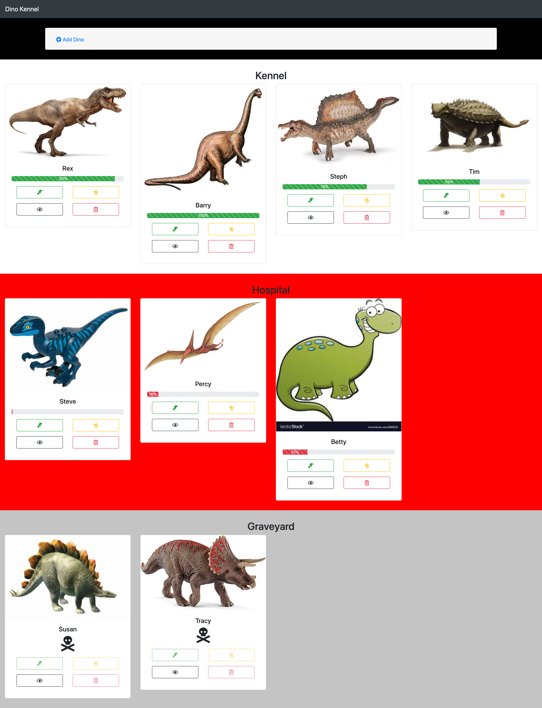
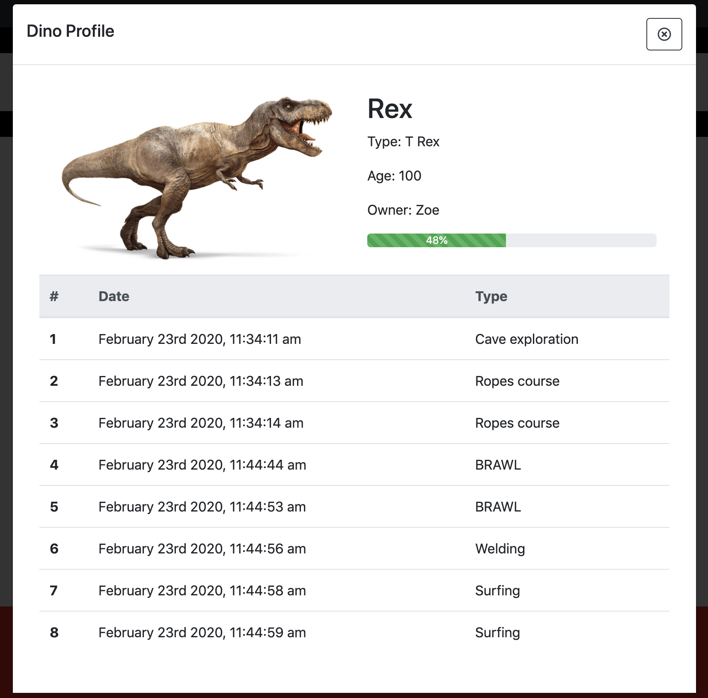
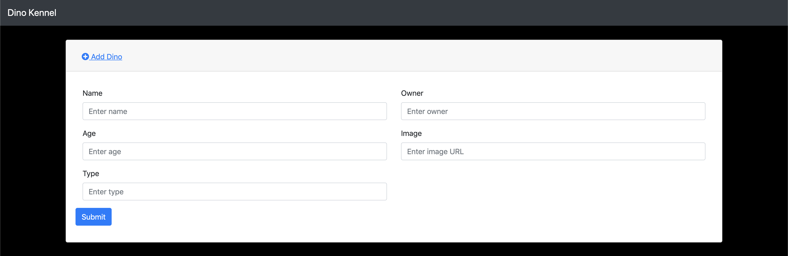

# Dino Kennel

## **NOTE:** You cannot start coding until your project board and tickets have been approved by an instructor

## Description
This project showcases all the vanilla javascript we learned in the foundations milestones.  It is designed to be a record keeping application for a dinosaur kennel.

### Feature List
- Healthy dinos show in the kennel
- Sick dinos show in the hospital
- Dead dinos show in the graveyard
- Dinos can be removed from the kennel
- Dinos can be added to the kennel
- Dinos can be fed
- Dinos can be petted
- Dinos can be sent on an adventure

## Technical Requirements
* You must use [Boostrap](https://getbootstrap.com/) to style your page components.
* Your JS file should be comprised of functions, no actions should happen in your code outside of a function
* Your HTML and JS should all have proper indentations
* You should be using ES6 modules
* Your JS code should be formatted correctly!

## Screenshots
### Full Page view

### Single Dino Modal

### Add New Dino

## How to Run
1. Clone down this repo
1. Make sure you have http-server installed via npm. If not get it [HERE](https://www.npmjs.com/package/http-server).
1. On your command line run `hs -p 9999`
1. In your browser go to `http://localhost:9999`
